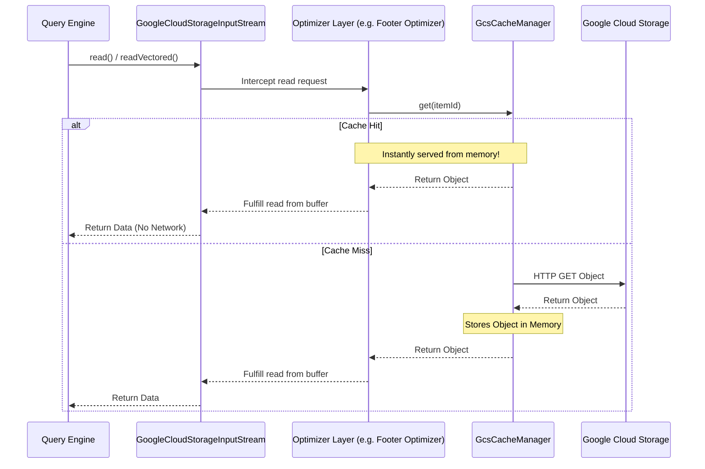

# Caching Layer

## How it Works
To further reduce latency for metadata-heavy operations, `gcs-analytics-core` provides a configurable in-memory caching layer using Caffeine. The cache is bound to the lifecycle of the `GcsFileSystem` instance. When multiple tasks or queries running on the same executor node attempt to access the same metadata objects, the cache ensures that only the first request incurs a network round-trip.

*   **Small Object Cache**: Caches the entirety of very small objects. This is effective for larger datasets with small fact tables or a few hot small files. For example, allocating a 500 MB small object cache on a 30-node cluster yields up to a 5% scan time improvement for the TPCDS 10TB benchmark in Apache Iceberg.
*   **Footer Cache**: Caches the prefetched footers of larger files (like Parquet). If multiple readers need to parse the same file's schema, it can be served instantly from memory. *(Note: Because this cache is bound to the `GcsFileSystem` instance, it provides no additional performance gains over footer prefetching in workloads like Apache Iceberg where the filesystem instance is not globally shared. It is most effective in use cases where a single `FileSystem` instance is initialized and heavily reused. Enable the worker-level disk cache below to share these entries across filesystem instances and executor processes.)*
*   **Worker-Level Disk Cache (L2)**: An optional second tier that persists footers and small objects as files under a single local directory (ideally on SSD) shared by **every executor process on the host**. The in-memory caches act as L1; on an L1 miss the entry is served from disk if any executor on the host has fetched it before, avoiding a GCS round-trip entirely.

## Worker-Level Disk Cache Design

The disk cache is coordinated purely through the filesystem — there is no inter-process communication:

*   **Correctness via immutability**: Entries are keyed by `(bucket, object, content generation, kind)`. GCS object content is immutable per generation, so a cached entry can never be stale; the TTL exists only to bound disk turnover. Objects whose generation is unknown simply bypass the disk tier.
*   **Atomic publishing**: A writer downloads into a private temporary file and atomically renames it into place. A visible entry file is therefore always complete — readers never need a lock.
*   **Safe eviction**: POSIX unlink semantics allow the janitor to delete an entry while another process is reading it; the reader's open file descriptor stays valid and the space is reclaimed on close.
*   **Download deduplication**: On a miss, a per-key advisory file lock (`flock`) elects one process on the host to download the entry. Losers read through to GCS instead of waiting, so the cache can only ever help. The OS releases the lock automatically if the holder dies, so stale locks cannot occur.
*   **Strict size limit via admission control**: Each process tracks a host-wide usage estimate (reconciled periodically by the janitor into a stats file). Writes are skipped once the estimate reaches the configured maximum — so when eviction cannot keep up with write pressure, the cache stops growing instead of exceeding the limit.
*   **Approximate LRU**: The entry file's last-modified time is the recency signal, refreshed (throttled) on hits. A background janitor — every process schedules it, but a host-wide lock elects a single runner — evicts the least recently used entries down to the low watermark whenever usage exceeds the high watermark, sweeps expired entries, and cleans up temporary files abandoned by crashed writers.
*   **Integrity**: Each entry carries a header with a magic number, creation time, payload length, and CRC32C checksum; truncated or corrupt entries are detected and deleted on read.

**Deployment note**: All executor processes must see the same local path. This works out of the box for standalone deployments and YARN. On Kubernetes, executor pods need a `hostPath` (or local PV) volume mount — an `emptyDir` is per-pod and shares nothing (the cache still works, but degrades to per-pod scope). The cache directory is created with owner-only permissions (`0700`); sharing is intended across applications of the same user, not across users.

### Cache Flow Diagram

## Internal Implementation Details

The caching layer is implemented using a pluggable, generic cache interface to ensure thread-safety and atomic operations across concurrent reads.

*   **[`AnalyticsCacheManager`](../../client/src/main/java/com/google/cloud/gcs/analyticscore/client/AnalyticsCacheManager.java)**: A thread-safe registry that initializes and holds the specialized caches (footer cache and small object cache). It ensures that concurrent requests for the same object (`GcsItemId`) only trigger a single network load via its atomic `getFooter` and `getSmallObject` methods.
*   **[`AnalyticsCache`](../../common/src/main/java/com/google/cloud/gcs/analyticscore/common/cache/AnalyticsCache.java)**: The base interface defining generic in-memory cache operations.
*   **[`AnalyticsCacheCaffeineImpl`](../../common/src/main/java/com/google/cloud/gcs/analyticscore/common/cache/AnalyticsCacheCaffeineImpl.java)**: The primary implementation backed by a Caffeine `Cache`. It is configured with a maximum byte weight and dynamically evicts older entries.
*   **[`AnalyticsCacheNoOpImpl`](../../common/src/main/java/com/google/cloud/gcs/analyticscore/common/cache/AnalyticsCacheNoOpImpl.java)**: A singleton, no-op implementation used when a specific cache is disabled via configuration, allowing the manager to operate without complex null checks.
*   **[`SharedDiskCache`](../../common/src/main/java/com/google/cloud/gcs/analyticscore/common/cache/disk/SharedDiskCache.java)**: The worker-level L2 tier. One JVM-wide instance per cache directory; handles entry reads/writes with atomic renames, per-key advisory locking, admission control, and lazy TTL checks.
*   **[`SharedDiskCacheJanitor`](../../common/src/main/java/com/google/cloud/gcs/analyticscore/common/cache/disk/SharedDiskCacheJanitor.java)**: Background maintenance elected via a host-wide lock: LRU eviction between watermarks, TTL sweeps, usage reconciliation, and orphaned temp-file cleanup.

## Configuration Knobs

The caching subsystem is configured via [`GcsCacheOptions`](../../client/src/main/java/com/google/cloud/gcs/analyticscore/client/GcsCacheOptions.java):

**Small Object Caching:**
*   `analytics-core.small-file.cache.enabled`: Controls whether small object caching is enabled (Default: `false`).
*   `analytics-core.small-file.cache.max-size-bytes`: The maximum capacity of the small object cache (Default: `209715200` i.e., 200 MB).

**Footer Caching:**
*   `analytics-core.footer.cache.enabled`: Controls whether the Parquet footer cache is enabled (Default: `false`).
*   `analytics-core.footer.cache.max-size-bytes`: The maximum capacity of the footer cache (Default: `104857600` i.e., 100 MB).

**Worker-Level Disk Caching:**
*   `analytics-core.cache.disk.enabled`: Controls whether the host-shared disk cache is enabled (Default: `false`).
*   `analytics-core.cache.disk.directory`: The local directory backing the cache; must be the same for all executors on the host (required when enabled).
*   `analytics-core.cache.disk.max-size-bytes`: The maximum total size of the disk cache, enforced by admission control (Default: `10737418240` i.e., 10 GB).
*   `analytics-core.cache.disk.ttl-millis`: Entry time-to-live from creation; `0` disables TTL (Default: `86400000` i.e., 24 hours).
*   `analytics-core.cache.disk.eviction.high-watermark`: Usage fraction above which LRU eviction starts (Default: `0.95`).
*   `analytics-core.cache.disk.eviction.low-watermark`: Usage fraction down to which LRU eviction proceeds (Default: `0.85`).
