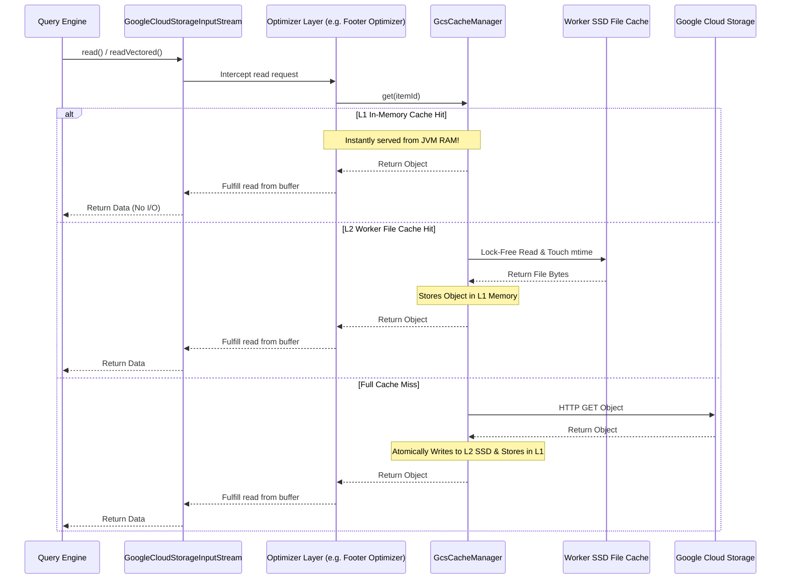

# Caching Layer

## How it Works
To further reduce latency for metadata-heavy operations, `gcs-analytics-core` provides a configurable multi-tier caching layer supporting both **in-memory executor-level caching (Caffeine)** and **worker-level local storage caching (SSD/File-based)**.

When multiple tasks or queries running across executor JVM processes on the same worker node attempt to access the same metadata objects, the cache ensures that only the first request incurs a network round-trip.

*   **Small Object Cache**: Caches the entirety of very small objects. This is effective for larger datasets with small fact tables or a few hot small files. For example, allocating a 500 MB small object cache on a 30-node cluster yields up to a 5% scan time improvement for the TPCDS 10TB benchmark in Apache Iceberg.
*   **Footer Cache**: Caches the prefetched footers of larger files (like Parquet). If multiple readers need to parse the same file's schema, it can be served instantly from memory or local SSD.
*   **Worker-Level File Cache (SSD)**: When enabled, persists cached objects to a shared local directory (such as a local NVMe SSD). This allows multiple executor processes on the same physical worker VM to share cached data, and preserves cached footers across short-lived `GcsFileSystem` lifecycles.

### Cache Flow Diagram

## Internal Implementation Details

The caching layer is implemented using a pluggable, generic cache interface to ensure thread-safety and atomic operations across concurrent reads.

*   **[`AnalyticsCacheManager`](../../client/src/main/java/com/google/cloud/gcs/analyticscore/client/AnalyticsCacheManager.java)**: A thread-safe registry that initializes and holds the specialized caches (footer cache and small object cache).
*   **[`AnalyticsCache`](../../common/src/main/java/com/google/cloud/gcs/analyticscore/common/cache/AnalyticsCache.java)**: The base interface defining generic cache operations.
*   **[`AnalyticsCacheCaffeineImpl`](../../common/src/main/java/com/google/cloud/gcs/analyticscore/common/cache/AnalyticsCacheCaffeineImpl.java)**: The in-memory L1 cache backed by Caffeine.
*   **[`AnalyticsCacheHybridImpl`](../../common/src/main/java/com/google/cloud/gcs/analyticscore/common/cache/AnalyticsCacheHybridImpl.java)**: A 2-tier hybrid cache combining L1 memory and the L2 worker cache. A lookup consults L1, falls back to L2, and promotes an L2 hit into L1; its atomic loader chains both tiers so a load runs at most once.
*   **[`AnalyticsCacheDiskImpl`](../../common/src/main/java/com/google/cloud/gcs/analyticscore/common/cache/disk/AnalyticsCacheDiskImpl.java)**: An `AnalyticsCache` view over the `SharedDiskCache` engine used as the L2 tier. A key mapper converts each item to a disk key, or signals "not cacheable on disk" (bypassing L2) when an object's content generation is unknown.
*   **[`SharedDiskCache`](../../common/src/main/java/com/google/cloud/gcs/analyticscore/common/cache/disk/SharedDiskCache.java)**: The worker-level L2 engine on local storage (SSD). One JVM-wide instance per cache directory, shared by all executor processes on the host. Atomic-rename publishing, lock-free reads, per-key advisory-lock download deduplication, strict-limit admission control, CRC/header integrity, and lazy TTL checks.
*   **[`SharedDiskCacheJanitor`](../../common/src/main/java/com/google/cloud/gcs/analyticscore/common/cache/disk/SharedDiskCacheJanitor.java)**: Background maintenance elected via a host-wide lock: LRU eviction between watermarks, TTL sweeps, usage reconciliation to a stats file, and orphaned temp-file cleanup.
*   **[`AnalyticsCacheNoOpImpl`](../../common/src/main/java/com/google/cloud/gcs/analyticscore/common/cache/AnalyticsCacheNoOpImpl.java)**: A singleton, no-op implementation used when a specific cache is disabled.

## Configuration Knobs

The caching subsystem is configured via [`GcsCacheOptions`](../../client/src/main/java/com/google/cloud/gcs/analyticscore/client/GcsCacheOptions.java):

**Small Object Caching:**
*   `analytics-core.small-file.cache.enabled`: Controls whether small object caching is enabled (Default: `false`).
*   `analytics-core.small-file.cache.max-size-bytes`: The maximum capacity of the small object in-memory cache (Default: `1073741824` i.e., 1 GB).

**Footer Caching:**
*   `analytics-core.footer.cache.enabled`: Controls whether the Parquet footer cache is enabled (Default: `false`).
*   `analytics-core.footer.cache.max-size-bytes`: The maximum capacity of the footer in-memory cache (Default: `1073741824` i.e., 1 GB).

**Worker-Level File Caching (Shared SSD):**
*   `analytics-core.worker.cache.enabled`: Controls whether worker-level local file caching is enabled across executors (Default: `false`).
*   `analytics-core.worker.cache.directory`: The root directory on local disk/SSD to store cached objects; every executor process on the host must point at the same directory to share entries (Default: `${java.io.tmpdir}/gcs-analytics-cache`).
*   `analytics-core.worker.cache.max-size-bytes`: The maximum disk capacity for the worker-level file cache, enforced by admission control (Default: `10737418240` i.e., 10 GB).
*   `analytics-core.worker.cache.ttl-millis`: Entry time-to-live from creation; `0` disables TTL. Entries are keyed by object generation, so TTL bounds disk turnover, not correctness (Default: `86400000` i.e., 24 hours).
*   `analytics-core.worker.cache.eviction.high-watermark`: Usage fraction above which background LRU eviction starts (Default: `0.95`).
*   `analytics-core.worker.cache.eviction.low-watermark`: Usage fraction down to which background LRU eviction proceeds (Default: `0.85`).
