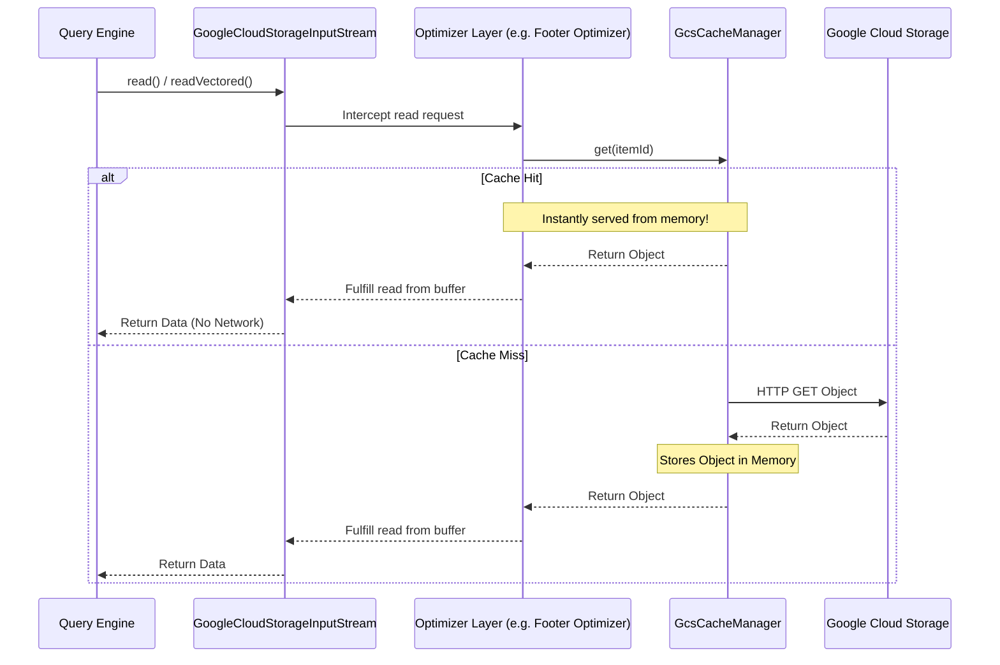

# Caching Layer

## How it Works
To further reduce latency for metadata-heavy operations, `gcs-analytics-core` provides a configurable in-memory caching layer using Caffeine. The cache is bound to the lifecycle of the `GcsFileSystem` instance. When multiple tasks or queries running on the same executor node attempt to access the same metadata objects, the cache ensures that only the first request incurs a network round-trip.

*   **Small Object Cache**: Caches the entirety of very small objects. This is effective for larger datasets with small fact tables or a few hot small files. For example, allocating a 500 MB small object cache on a 30-node cluster yields up to a 5% scan time improvement for the TPCDS 10TB benchmark in Apache Iceberg.
*   **Footer Cache**: Caches the prefetched footers of larger files (like Parquet). If multiple readers need to parse the same file's schema, it can be served instantly from memory. *(Note: When the cache is bound to the `GcsFileSystem` instance, it provides no additional performance gains over footer prefetching in workloads like Apache Iceberg where the filesystem instance is not globally shared. Enabling the shared cache — see below — lifts this limitation.)*

## Shared (Executor-Level) Caching

By default each `AnalyticsCacheManager` owns private caches whose lifetime matches the enclosing `GcsFileSystem`. Engines such as Apache Iceberg create a fresh, short-lived file system per task and never reuse it, so every instance starts cold and the footer cache never pays off. Setting `analytics-core.cache.shared.enabled=true` makes the footer and small-object caches process-wide (typically one JVM per executor), so a warm cache is reused across those instances.

Sharing a cache across instances means one caller could, in principle, be served bytes another caller loaded. That would be a cross-credential data leak: a cache hit performs no network request, so **no credential is checked on a hit**. The design prevents this rather than relying on operators to avoid it:

*   **Scope-partitioned keys.** Shared entries are keyed by `(scope, GcsItemId)`, not `GcsItemId` alone. The `scope` is an authorization-boundary token; a manager can only read or invalidate entries under its own scope. Two callers share an entry only when they present the same scope.
*   **Scopes come from an authority, never from inference.** The integration layer supplies the scope from a credential's grant — for the Iceberg connector this is the object-name prefix a credential was *vended* for (`StorageCredential.prefix()`). A vended prefix is the authorization boundary the catalog asserted, so every reader presenting it is entitled to the same objects. Crucially, the scope is **never** inferred from the paths a caller has managed to read (for example, by taking the parent "directory" of a successful read): a single successful read only proves access to that boundary the credential already declares, and generalizing it to a parent prefix can over-grant when the underlying IAM condition is not a plain path prefix.
*   **Unknown scope ⇒ no sharing.** When no trusted scope is available (for example, the connector's root storage that falls back to ambient credentials whose scope we cannot know), the manager keeps private caches even if sharing is enabled. This fails closed.
*   **Scope is not user-configurable.** It is passed programmatically, not read from the property map, so a caller cannot set another principal's scope to obtain their cached bytes.

## Time-To-Live and Credential Expiry

The footer and small-object caches accept an optional TTL (`analytics-core.footer.cache.ttl-seconds`, `analytics-core.small-file.cache.ttl-seconds`; `0` disables it). Because a cache hit never re-checks credentials, a cached object would otherwise remain readable after the credential that authorized it expires or is revoked. A TTL bounds that window: when reading under short-lived vended credentials, set the TTL at or below the credential lifetime. Closing a `GcsFileSystem` clears its private caches; shared-cache entries intentionally survive individual instances and are bounded by the size limit and TTL.

### Cache Flow Diagram

## Internal Implementation Details

The caching layer is implemented using a pluggable, generic cache interface to ensure thread-safety and atomic operations across concurrent reads.

*   **[`AnalyticsCacheManager`](../../client/src/main/java/com/google/cloud/gcs/analyticscore/client/AnalyticsCacheManager.java)**: A thread-safe registry that initializes and holds the specialized caches (footer cache and small object cache). It ensures that concurrent requests for the same object (`GcsItemId`) only trigger a single network load via its atomic `getFooter` and `getSmallObject` methods.
*   **[`AnalyticsCache`](../../common/src/main/java/com/google/cloud/gcs/analyticscore/common/cache/AnalyticsCache.java)**: The base interface defining generic in-memory cache operations.
*   **[`AnalyticsCacheCaffeineImpl`](../../common/src/main/java/com/google/cloud/gcs/analyticscore/common/cache/AnalyticsCacheCaffeineImpl.java)**: The primary implementation backed by a Caffeine `Cache`. It is configured with a maximum byte weight and dynamically evicts older entries.
*   **[`AnalyticsCacheNoOpImpl`](../../common/src/main/java/com/google/cloud/gcs/analyticscore/common/cache/AnalyticsCacheNoOpImpl.java)**: A singleton, no-op implementation used when a specific cache is disabled via configuration, allowing the manager to operate without complex null checks.

## Configuration Knobs

The caching subsystem is configured via [`GcsCacheOptions`](../../client/src/main/java/com/google/cloud/gcs/analyticscore/client/GcsCacheOptions.java):

**Small Object Caching:**
*   `analytics-core.small-file.cache.enabled`: Controls whether small object caching is enabled (Default: `false`).
*   `analytics-core.small-file.cache.max-size-bytes`: The maximum capacity of the small object cache (Default: `209715200` i.e., 200 MB).

**Footer Caching:**
*   `analytics-core.footer.cache.enabled`: Controls whether the Parquet footer cache is enabled (Default: `false`).
*   `analytics-core.footer.cache.max-size-bytes`: The maximum capacity of the footer cache (Default: `104857600` i.e., 100 MB).
